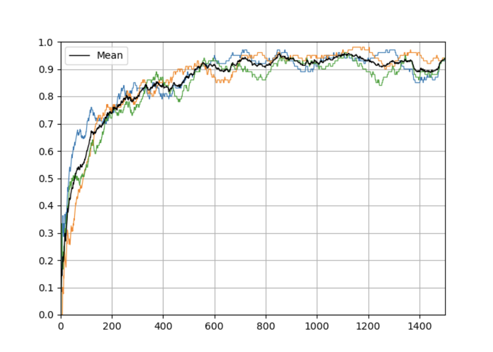

# DQN Agent

This repository contains an implementation of a DQN agent that can be used to solve reinforcement learning problems.


## Overview

The DQN agent uses deep learning and reinforcement learning principles to learn how to perform actions in an environment. The agent posesses the ability to incorporate a number of different model improvements on vanilla Deep Q Learning. These improvements include:


* Prioritized Replay Memory
* Smart Reward (Intermediate instead of Sparse)
* Gradual Beta Incement (PRM variable)
* Dueling Deep Q Learning
* Double Deep Q Learning
* Learning Rate Schedule
* Gradient Clipping

Each of these can be set to True or False to include them.

## Code

The main part of the code is the `DQNAgent` class, which defines the behavior of the agent. It includes the model definition, the training loop, and various other methods that are used in the reinforcement learning process.

```python
class DQNAgent:
      ...
 ```

Here's an example of how to use the agent:

```python
agent = DQNAgent(True)
agent.warm_up_memory_buffer()
agent.run_dqn_agent()
 ```
In this example, an agent is created, the memory buffer is warmed up with initial experiences, and then the agent is trained.

## Performance
Agent with all improvements set to True reaches convergence after around 600 episodes. 

